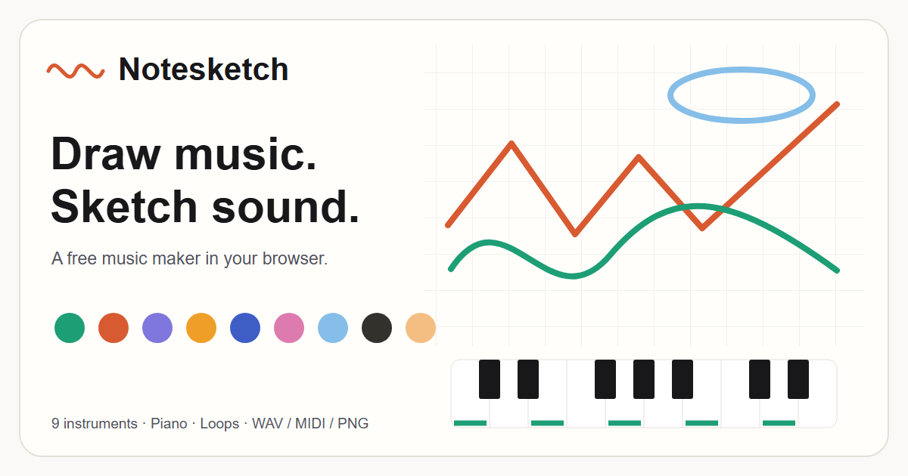

# Notesketch

Draw music. Sketch sound.

Notesketch is a browser-based visual music studio that turns your drawings into melodies and looping compositions. Play instruments, experiment with musical scales, and export your music or artwork without creating an account.



## Features

- Draw and layer melodies with nine color-coded instruments.
- Edit sketches with the pen, eraser, undo, brush sizes, and grid snap.
- Choose musical scales, keys, tempo, beats, and loop programs.
- Play an interactive piano with scale lock, freestyle mode, and custom note filters.
- Adjust volume and tone, and switch backgrounds or use Stage visuals.
- Load presets, save sketches locally, or share a composition link.
- Export loops as WAV audio, MIDI notes, or PNG artwork.
- Record the canvas and audio as a video take in supported browsers.
- Use a responsive layout on desktop, tablet, and mobile.

## Run locally

Install Node.js with npm. Node.js 22 or newer is suitable for the app and included test scripts.

```sh
git clone https://github.com/Zoyz0/notesketch.git
cd notesketch
npm ci
npm run dev
```

Open the local URL printed by Vite. This repository is private, so cloning requires access to it. No API keys, database, or backend service are required to run the studio.

## How to play

1. Select an instrument color and draw on the canvas. Horizontal position sets timing; vertical position sets pitch.
2. Press Play and adjust the tempo, scale, or beat to shape your loop.
3. Enable Piano Keyboard to play notes directly. Colored keys follow the selected scale; freestyle unlocks every note.
4. Save your sketch, copy a composition link, or export your creation. Use Record Take, then Export Take, for video.

Space toggles playback when you are not interacting with another control. Escape closes dialogs. The in-app help and [music drawing guide](./about.html) explain the controls.

## Build and test

```sh
npm run test:deploy
npm run build
npm run test:browser
```

The production build is written to `dist/`. Run `npm run preview` to inspect it locally.

Deployment checks cover URL configuration, SEO output, preview indexing, and runtime assets. Browser checks exercise controls, audio, sharing, exports, recording, and responsive layouts. They require Microsoft Edge on Windows by default; set `STUDIO_BROWSER` to another compatible Chromium executable if needed. Browser tests are not part of the deployment build.

## Deploy to Vercel

Import this repository into Vercel with the project root set to `.`. The included `vercel.json` configures Vite, `npm ci`, `npm run build`, and the `dist` output directory.

Alternatively, deploy from the project folder:

```sh
npx vercel --prod
```

The canonical site URL is `https://notesketch.vercel.app/`, configured in `site.config.json`. Builds use it for canonical links, social image URLs, structured data, and the sitemap, including when developing locally. To change the domain, update `site.config.json` or override it with `NOTESKETCH_SITE_URL` and redeploy. Preview builds use `noindex,follow` metadata.

See [deployment instructions](./DEPLOYMENT.md) and [SEO setup](./SEO-SETUP.md) for domain configuration, sitemaps, and search-engine submission.

## Storage and browser support

Saved sketches stay in the current browser's local storage and are not automatically synced between devices. Clearing browser data can remove them; export important creations or keep their composition links. Shared links contain the composition's drawing and musical settings, so only share them with people who should have access.

Use a modern browser with Canvas and Web Audio support. Audio may require a click or tap before playback. Video recording depends on MediaRecorder and canvas capture support; the app selects an available MP4 or WebM format. Use localhost or HTTPS for browser APIs that require a secure context.

## Project structure

- `index.html` — studio interface, drawing, synthesis, piano, and exports.
- `about.html` — crawlable guide to the studio.
- `vite.config.js` — multi-page build, runtime assets, and generated SEO files.
- `site.config.json` / `.env.example` — site URL configuration.
- `vercel.json` — deployment settings and response headers.
- `scripts/` — deployment and browser verification.
- `stock/` — bundled Stage artwork.
- `manifest.webmanifest` / `sw.js` — install metadata and network-first offline fallback.

## Credits

Created by Dimas Mahardhika Wibowo. Inspired by [Play Music Theory](https://playmusictheory.net).
